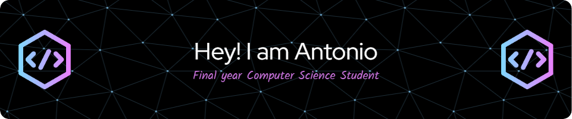

Passionate computer science student deeply engaged in the realms of Object-Oriented Programming and mobile app development. I thrive on crafting efficient, user-centric solutions and am eager to collaborate on innovative projects. Always learning, I welcome challenges and am open to sharing insights about coding, OOP, and the dynamic world of tech. Let's create something extraordinary! 🔧📱💻

- 🔭 I'm currently immersed in the dynamic world of Object-Oriented Programming and mobile application development for my CS Degree dissertation project.
- 🌱 Currently learning and honing my skills to stay updated with the latest technologies and trends in the ever-evolving tech landscape.
- 👯 I'm eager to collaborate on innovative projects that leverage creativity and cutting-edge technology.
- 🤔 Open to receiving guidance and assistance in exploring new challenges and refining my coding expertise.
- 💬 Ask me about anything!
- 📫 How to reach me: antonioruizmartincs@gmail.com

### Skills:

